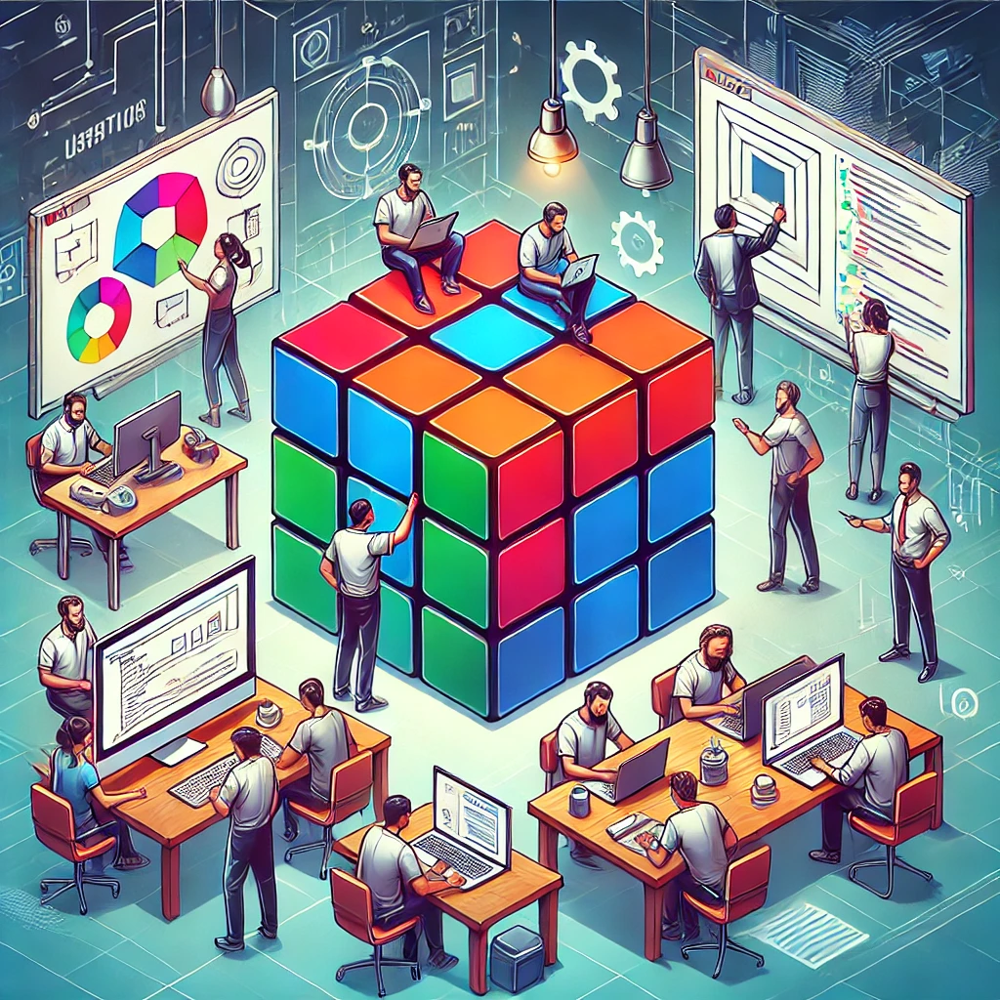

# Why Breaking Down Problems Matters in Software Engineering

{width=100%,height=150}

As software engineers, we deal with complexity every day. Whether we’re building features, fixing bugs, or designing entire systems. One of the most valuable skills any software engineer can improve on is the ability to break down problems into smaller, manageable parts. It sounds simple, but it’s a game-changer in practice. Here’s why:

1. Complexity Becomes Manageable

    Modern software systems are layered and interconnected. Trying to solve everything at once leads to confusion and fragile designs. By breaking down a problem, you isolate concerns and make it easier to understand and reason through each piece. This leads to cleaner, more maintainable code and fewer surprises down the line.

1. You Can Ship Faster

    Decomposing a problem enables incremental progress. You can build, test, and deploy smaller parts independently, which means quicker releases and faster feedback loops. Whether you're prototyping a new feature or scaling a service, working in small, well-defined steps keeps the momentum going and helps avoid costly rewrites.

1. Teamwork Gets Easier

    In a collaborative environment, problem decomposition is essential. It allows engineers to work in parallel without stepping on each other’s toes. It clarifies responsibilities, reduces bottlenecks, and makes onboarding smoother as the new team members can pick up a small part of the system and start contributing meaningfully right away.

Breaking things down isn't just a tactic, it’s a mindset. Whether you’re tackling a tough algorithm or designing a distributed system, taking the time to decompose the problem will pay off in clarity, speed, and long-term quality.

Have thoughts or techniques you use for breaking down problems? I’d love to hear them.
