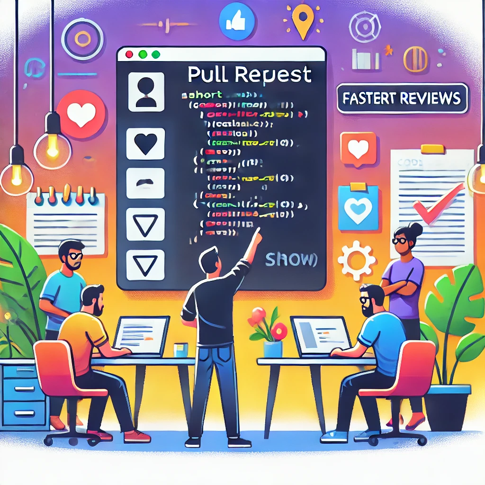

# Why Smaller Pull Requests Make Better Code

As a software engineer, one thing I consistently advocate for is keeping pull requests small and focused. It’s not just a matter of preference, it’s a practice that improves code quality, speeds up reviews, and reduces risk.

Here’s why smaller Pull Requests(PRs) are almost always better:

## Easier to Review

Small PRs are faster to read and easier to understand. When reviewers can focus on a single concern or feature, they’re more likely to catch bugs, suggest improvements, and approve changes confidently. Large PRs tend to get skimmed or delayed—neither of which is good for quality.

## Better Test Coverage

When a PR only introduces one thing at a time, it's easier to write targeted tests and verify that they're doing what they should. You’re less likely to miss edge cases or accidentally break something unrelated. It also simplifies test review, which is often overlooked in larger changes.

## Faster Feedback and Merges

Smaller changes mean less overhead for reviewers, which leads to quicker feedback and faster merges. That shortens the development cycle, keeps branches from drifting, and reduces merge conflicts down the road.

## Clearer Commit History

When each PR addresses a single change or feature, your commit history becomes a clean, understandable timeline of your project. That’s invaluable for debugging, auditing, and onboarding new engineers.

## Reduced Risk

If something does go wrong, it’s much easier to roll back or hotfix a small, isolated change than it is to untangle a large, multi-feature PR. Smaller changes reduce the blast radius of bugs.

## Practical Tips

- **Limit scope**: Stick to one logical change per PR.
- **Break it up**: If you're working on something big, break it into staged or dependent PRs.
- **Communicate**: Leave good descriptions and context so reviewers understand the intent quickly.

Smaller pull requests aren't just easier to manage, they lead to better software. They reflect thoughtful, disciplined engineering, and they help build trust across the team.
